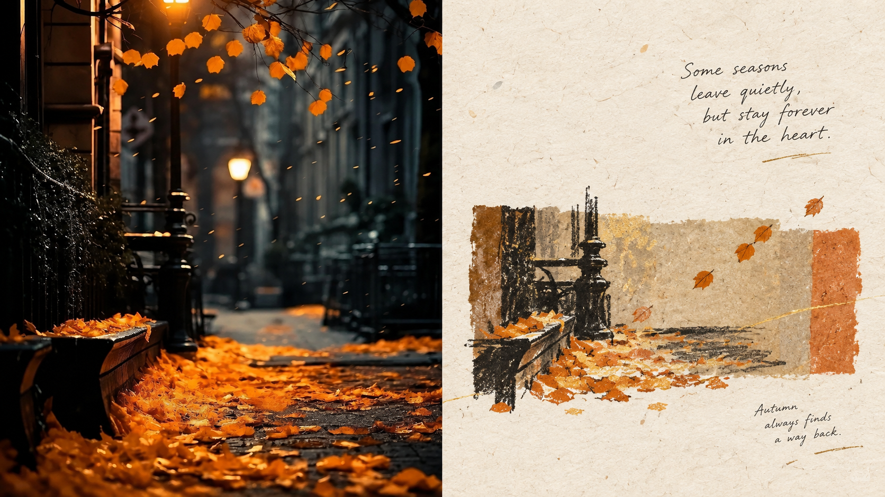
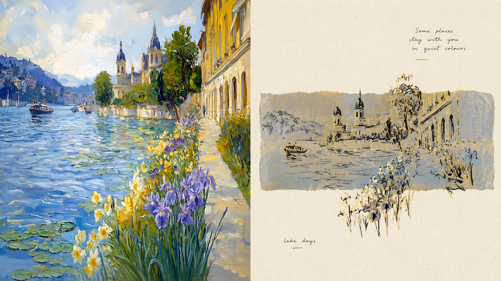
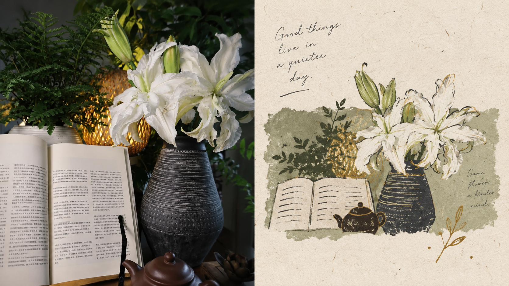
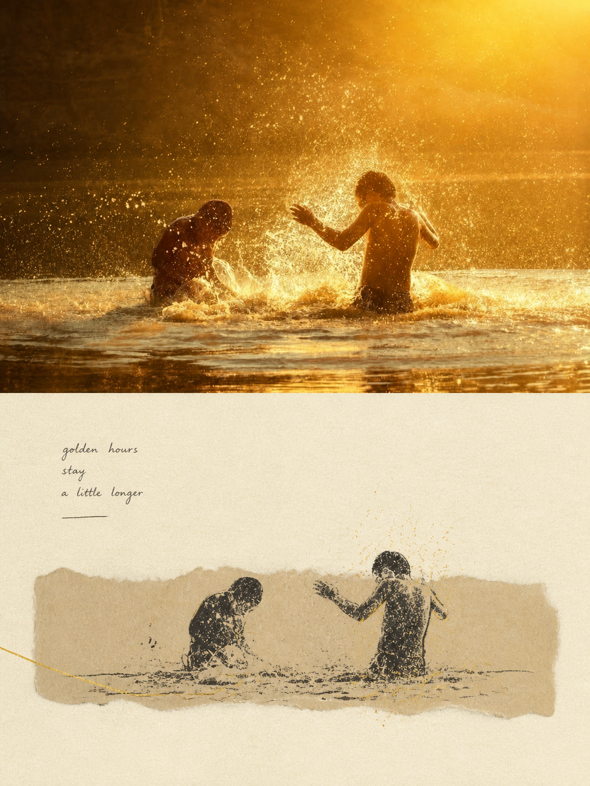
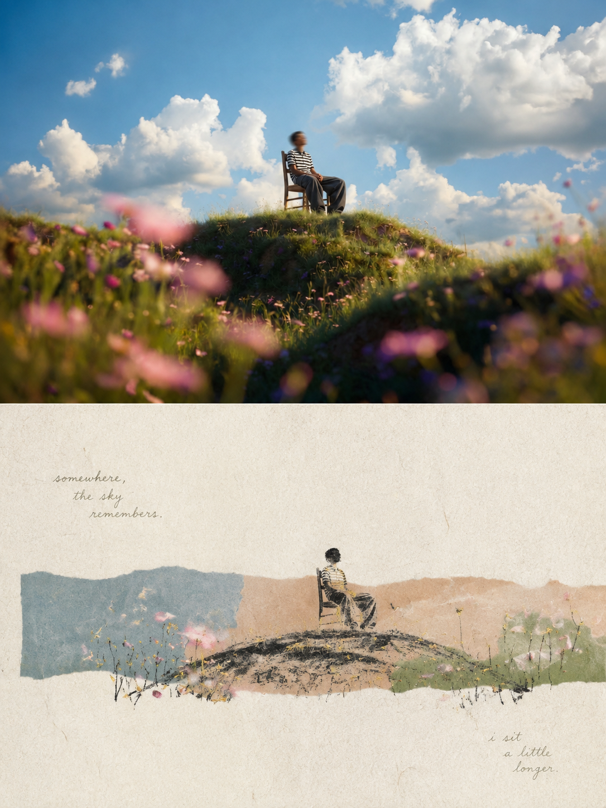
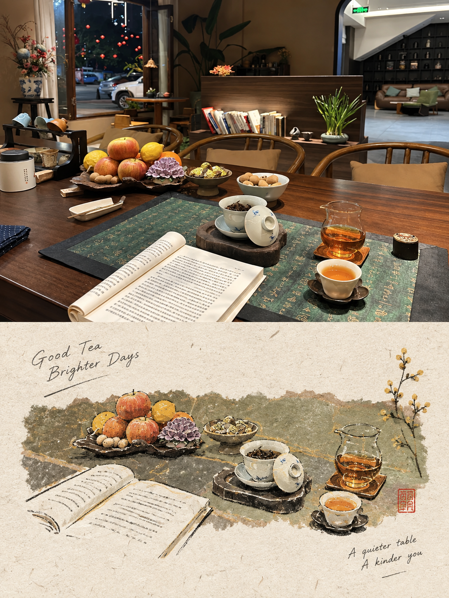
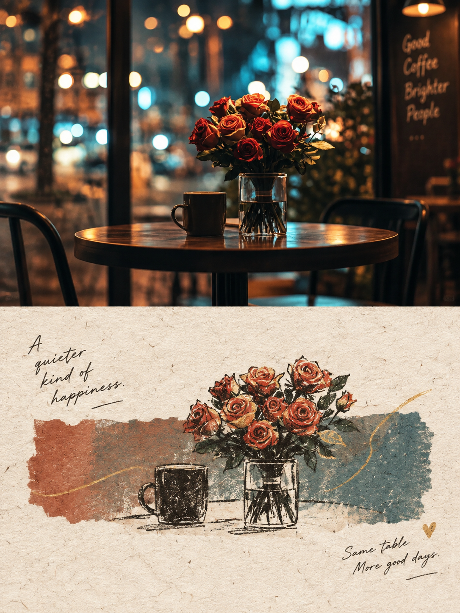

<div align="center">

# XXD Panel 112｜금선 종이 기록

불규칙한 종이 색면 위에 조용히 빛나는 기억 하나를 담다.


<a href="README.md">简体中文</a> · <a href="README.en.md">English</a> · <a href="README.ja.md">日本語</a> · <strong>한국어</strong> · <a href="README.ar.md">العربية</a>

</div>

## 샘플 작품

本项目已发布 8 张实际样片，图片文件位于 `assets/examples/`。

| sample-05 | sample-06 |
| --- | --- |
|  |  |
| sample-07 | sample-08 |
|  |  |
| sample-09 | sample-10 |
|  |  |
| sample-11 | sample-12 |
|  |  |

## 어울리는 상황과 해결하는 문제

어떤 사진에는 더 많은 정보보다 기억 하나를 받쳐 줄 종이 면이 필요합니다. **Panel 112**는 현실 사진을 남기고 다른 절반을 미색 수제 종이, 좁은 가로색 영역, 작은 왁스 크레용 도장, 극소량 금선으로 압축합니다. 조용한 인물, 여행 조각, 식물과 사물, 문예 표지, 개인 기념과 전시에 잘 맞습니다.

종이 스타일이 탁하고 무거워지는 문제, 금색이 번쩍이거나 촌스러워지는 문제, 전체 묘사가 경직되는 문제, 색면과 장식으로 화면을 가득 채우는 문제를 해결합니다.

## 사용 팁

- **선명한 사진 한 장부터 시작하세요:** 피사체, 동작, 관계가 잘 보이는 이미지를 고른 뒤 출력 방식과 비율을 정합니다.
- **파라미터를 한 문장으로 연결하세요:** “상하 / 좌우 / 순수 디자인 + 16:9 / 3:4 / 휴대폰 배경화면”처럼 말하고 컴퓨터·태블릿·스마트워치 크기도 덧붙일 수 있습니다.
- **남겨야 할 것을 분명히 하세요:** 인물, 사물, 동작, 관계, 문구를 지정하되 레이아웃을 지나치게 고정하지 않아야 스타일이 자연스럽게 설계합니다.
- **텍스트 방식을 고르세요:** 이미지에서 지능적으로 생성하게 하거나, `--text exact --copy`로 정확한 문구를 고정하거나, `--text none`으로 글자를 없앨 수 있습니다.
- **사진 영역과 디자인 영역을 설명하세요:** 상하·좌우에서는 사진을 남길 쪽과 다시 디자인할 쪽을 말하고, 순수 디자인·배경화면은 전체 캔버스를 다시 설계한다고 알려 주세요.
- **한 장을 먼저 시험한 뒤 일괄 처리하세요:** 모드, 비율, 텍스트, 언어를 한 장에서 확인하고 같은 설정을 폴더에 적용합니다. 비교를 위해 한 번에 한 변수만 바꾸세요.

## 원본 프롬프트 · 5개 언어

[简体中文](references/original-prompt/zh-CN.md) · [English](references/original-prompt/en.md) · [日本語](references/original-prompt/ja.md) · [한국어](references/original-prompt/ko.md) · [العربية](references/original-prompt/ar.md)

중국어 파일은 원문을 그대로 보존하며 실행 시 유일한 창작 기준입니다. 다른 네 언어는 완전하고 충실한 열람용 번역입니다.

**특징:** 이중 수제 종이 · 불규칙한 가로색 영역 · 짙은 무광 왁스 크레용 선 · 절제된 금선 · 작은 도장형 주체 · 경계를 넘는 여백 · Risograph 입자

## 빠른 적합성 확인

| 필요한 것 | Panel 112의 답 |
|---|---|
| 조용하고 복고적이지만 무겁지 않은 종이 포스터 | 미색 수제 종이, 어두운 크레용 선, 소량의 금선이 기억 하나를 받칩니다. |
| 완전 묘사 없이도 주체 식별 | 구조와 분위기를 읽어 중앙의 좁은 색 영역 속 작은 도장으로 압축합니다. |
| 금색이 화려하거나 촌스럽지 않게 | 금선은 핵심 윤곽에만 쓰고 큰 여백과 얕은 표현으로 절제합니다. |

## 완성작의 대표 특징

- 현실과 이중 종이 디자인은 한 완성 캔버스이며 비교 모드는 정확한 50:50, 세 번째 띠는 없습니다.
- 미색 거친 섬유 종이 위 중앙에 좁고 불규칙한 가로색 영역과 작은 도장형 주체를 둡니다.
- 짙은 무광 왁스 크레용 선은 느슨하고 소박하며 핵심 윤곽만 극소량 금선으로 비춥니다.
- 주체가 여백으로 넘어갈 수 있지만 사실적 그림자나 복잡한 장식 없이 옅은 노화와 Risograph 입자를 유지합니다.
- 작고 부드러운 손글씨 영어는 사적인 메모처럼 들어가며 주인공을 압도하지 않습니다.

## 기능과 경계

네 모드, 여러 비율／정확 픽셀, 자동／정확／무텍스트, 폴더 일괄, 연결／독립 배경화면을 지원합니다. 폴더는 재귀적으로 집계하고 각 이미지를 격리 처리해 모든 PNG를 하나의 새 작업 폴더 바로 아래 저장합니다. 결과는 완성 캔버스 한 번 생성으로 만들며 중간 이미지, 샘플, 다른 Panel 결과를 다시 변환하지 않습니다. `compose_panel.py`는 마지막 무손실 조정과 감사에만 사용합니다.

## 텍스트와 언어

표시 언어를 명확히 정합니다. `prompt`는 원문의 소량 손글씨 영어, `exact`는 사용자 문구 그대로, `none`은 문자·숫자·Logo·가짜 문자를 금지합니다. 인물, 장소, 파일명으로 언어를 추측하지 않습니다.

## 네 가지 출력 모드

- `top-bottom`: 현실 사진을 위, Panel 112 디자인을 아래에 두고 각각 50%입니다.
- `left-right`: 현실 사진을 왼쪽, 디자인을 오른쪽에 두고 각각 50%이며 상하로 회전하지 않습니다.
- `design-only`: 전체 캔버스에는 이 Panel의 디자인만 보이고 사진은 참고로만 사용합니다.
- `wallpaper-pack`: 기기별로 완전한 캔버스를 생성합니다.

## 시작하기

```bash
git clone https://github.com/nevertoday/xxd-panel-112.git
mkdir -p ~/.codex/skills
ln -s "$(pwd)/xxd-panel-112" ~/.codex/skills/xxd-panel-112
```

`npx skills`로도 바로 설치할 수 있습니다:

```bash
npx skills add https://github.com/nevertoday/xxd-panel-112 --skill xxd-panel-112
```

GitHub에서 저장소를 가져와 같은 이름의 Skill을 설치합니다. 사용자 전역 Codex 설치는 `--global --agent codex --yes`를 추가하세요.

설치 후 Agent 세션을 다시 시작하고 호출하세요 `$xxd-panel-112`.

<!-- xxd-panel-catalog:start -->
## XXD Panel 전체 프로젝트

112개 Panel은 각각 독립된 원본 프롬프트와 미학을 유지합니다. 001–112 프로젝트를 빠짐없이 나열하고 현재 프로젝트를 굵게 표시합니다.

| Project | Style |
|---|---|
| [xxd-panel-001](https://github.com/nevertoday/xxd-panel-001) | 소박한 선 · 레트로 종이결 · 혼합 매체 · 재치 있는 은유 · 따뜻한 여백 |
| [xxd-panel-002](https://github.com/nevertoday/xxd-panel-002) | 서사적 윤곽 · 머뭇거리는 선 · 유사색 · 선택적 확대 · 인쇄 어긋남 |
| [xxd-panel-003](https://github.com/nevertoday/xxd-panel-003) | 연속 검은 선 · 공공 의제 · 힘점 · 침묵의 여백 · 해방 |
| [xxd-panel-004](https://github.com/nevertoday/xxd-panel-004) | 현지 현실 · 정밀 단선 · 기하 원근 · 주제 색 · 도시 브랜드 글자 |
| [xxd-panel-005](https://github.com/nevertoday/xxd-panel-005) | 둔중한 큰 형태 · 어두운 구조장 · 부분 드러냄 · 3층 색 질서 · 실크스크린 × 파스텔 |
| [xxd-panel-006](https://github.com/nevertoday/xxd-panel-006) | 주제 10–20% · 종이 여백 80–90% · 가는 손선 · 최대 네 색 · 아크릴 평면 |
| [xxd-panel-007](https://github.com/nevertoday/xxd-panel-007) | 실물 미니어처 · 확대／단면／반복 · 엇갈린 여백 · 가는 검정 손글씨 · 스캔 종이결 |
| [xxd-panel-008](https://github.com/nevertoday/xxd-panel-008) | 정사영 아이소메트릭 · 플랫폼／계단／문 · 공간 역설 · 동적 파스텔 · 무광 3D |
| [xxd-panel-009](https://github.com/nevertoday/xxd-panel-009) | 작은 앵커 · 넓은 여백 · 하나의 공간 관계 · 별색 체계 · 하프톤 실크스크린 |
| [xxd-panel-010](https://github.com/nevertoday/xxd-panel-010) | 거친 검정 실루엣 · 내부의 흰 특징 · 건식 재료 종이결 · 최소 환경 기호 · 그림책 편집 소문자 |
| [xxd-panel-011](https://github.com/nevertoday/xxd-panel-011) | 하나의 핵심 이미지 · 하나의 관계 · 연속 검은 선 · 능동적 침묵 · 하나의 기억색 |
| [xxd-panel-012](https://github.com/nevertoday/xxd-panel-012) | 고밀도 응집 · 외곽 희박화 · 기하학적 통제 · 하나의 생명색 · 흑회색 마이크로타입 |
| [xxd-panel-013](https://github.com/nevertoday/xxd-panel-013) | 가로 티켓 한 장 · 74/26 분할 · 치유 수채화 · 아이보리 여백 · 현지화 정보 스텁 |
| [xxd-panel-014](https://github.com/nevertoday/xxd-panel-014) | 접기와 절단면 · 겹침과 끼움 · 원본의 무게중심 · 실제 종이 섬유 · 읽히는 종이 문자 |
| [xxd-panel-015](https://github.com/nevertoday/xxd-panel-015) | 해체—선별—정제—재구성 · 소수 형태 · 엄격한 색 역할 · 아이보리 여백 · 아트북 미세 조판 |
| [xxd-panel-016](https://github.com/nevertoday/xxd-panel-016) | 하나의 주제 · 하나의 움직임 · 넓게 숨 쉬는 여백 |
| [xxd-panel-017](https://github.com/nevertoday/xxd-panel-017) | 둥근 형태 · 거칠고 끊긴 선 · 순색 평면 채색 · 밝은 색면 · 경쾌한 비대칭 |
| [xxd-panel-018](https://github.com/nevertoday/xxd-panel-018) | 하나의 시각 앵커 · 소수의 전중후경 종이 층 · 아이보리 여백 · 무광 종이 · 완전한 마이크로타입 |
| [xxd-panel-019](https://github.com/nevertoday/xxd-panel-019) | 먼저 알아보고 · 의도를 갖고 덜어 내며 · 글자와 함께 구성합니다 |
| [xxd-panel-020](https://github.com/nevertoday/xxd-panel-020) | 임파스토 섬 · 입체 미니어처 · 실제 나이프 자국 · 넓은 종이 여백 · 절제된 편집 글자 |
| [xxd-panel-021](https://github.com/nevertoday/xxd-panel-021) | 순검정 직사각형 · 주제 대부분은 내부 · 특징 하나만 돌파 · 떨리는 복사선 · 흰 음형과 미세 회색면 |
| [xxd-panel-022](https://github.com/nevertoday/xxd-panel-022) | 순검정 직사각형 · 주제 대부분은 내부 · 특징 하나만 돌파 · 매끄럽고 안정적인 선 · 색 신호 하나 |
| [xxd-panel-023](https://github.com/nevertoday/xxd-panel-023) | 원본이 고른 창 · 옅고 숨 쉬는 배경 · 부드러운 유색광 · 분사 입자 · 흐린 투영과 미세 조판 |
| [xxd-panel-024](https://github.com/nevertoday/xxd-panel-024) | 사진적 주제 · 길고 옅은 창 · 가로／세로／사선 원본 적응 · 동양적 여백 · 프리미엄 편집 |
| [xxd-panel-025](https://github.com/nevertoday/xxd-panel-025) | 첫눈에는 주제 · 두 번째에는 숨은 이미지 · 전경–배경 반전 · 모란디 2–4색 · 물리적 실크스크린 |
| [xxd-panel-026](https://github.com/nevertoday/xxd-panel-026) | 조용히 알아보고 · 부드럽게 덜어 내며 · 종이가 숨 쉬게 합니다 |
| [xxd-panel-027](https://github.com/nevertoday/xxd-panel-027) | 두꺼운 유백색 종이 · 얕은 요철 · 미세 음각선 · 무광 금빛 초점 · 박물관 질서 |
| [xxd-panel-028](https://github.com/nevertoday/xxd-panel-028) | 정사영 아이소메트릭 · 작은 종이 받침 · 원본 팔레트 · 가는 먹선 · 편집형 모형 |
| [xxd-panel-029](https://github.com/nevertoday/xxd-panel-029) | 가로 색면 · 밝은 왁스 파스텔 · 거친 수제 종이 · 리소그래프 입자 · 힘을 뺀 손글씨 |
| [xxd-panel-030](https://github.com/nevertoday/xxd-panel-030) | 실제 자연 재료 · 사각 색면 · 자연스러운 경계 넘김 · 최소한의 검은 선 · 편집 여백 |
| [xxd-panel-031](https://github.com/nevertoday/xxd-panel-031) | 하나의 핵심 모티프 · 원본 기반 기하 모체 · 민속 도록 · 내부의 거친 인쇄 흔적 · 외부의 정밀한 질서 |
| [xxd-panel-032](https://github.com/nevertoday/xxd-panel-032) | 글자와 이미지의 통합 · 문자 체계에 충실한 레터링 · 원본 특징 삽입 · 시각적 자간 · 넓은 여백 |
| [xxd-panel-033](https://github.com/nevertoday/xxd-panel-033) | 식별 가능한 모티프 · 평면 콜라주 · 크기 대비 · 원본 기반 선명한 색 · 표지 타이포그래피 |
| [xxd-panel-034](https://github.com/nevertoday/xxd-panel-034) | 작은 도장 · 2–4가지 별색 · 손으로 판 선 · 따뜻한 종이 · 현장 주석 |
| [xxd-panel-035](https://github.com/nevertoday/xxd-panel-035) | 하나의 블록 주체 · 원본 기반 선명한 색 · 무광 ABS · 조용한 배경 · 모듈형 글자 |
| [xxd-panel-036](https://github.com/nevertoday/xxd-panel-036) | 하나의 관계 · 가는 연속선 · 2–4 색면 · 수채 번짐 · 숨 쉬는 여백 |
| [xxd-panel-037](https://github.com/nevertoday/xxd-panel-037) | 배지 하나 · 원본 에나멜 색 · 백색 금속 테두리 · 유금 디테일 · 짧은 실물 그림자 |
| [xxd-panel-038](https://github.com/nevertoday/xxd-panel-038) | 원본 기반 천색 · 올 풀린 가장자리 · 손바느질 · 능동적 여백 · 숨은 감정 |
| [xxd-panel-039](https://github.com/nevertoday/xxd-panel-039) | 한 이미지 한 핵 · 중국 비단실 · 바늘 방향 층위 · 깨끗한 바탕 · 동양의 여백 |
| [xxd-panel-040](https://github.com/nevertoday/xxd-panel-040) | 실제 주인공 · 검은 선 인물 · 미니 서사 · 넉넉한 여백 |
| [xxd-panel-041](https://github.com/nevertoday/xxd-panel-041) | 주제 은유 · 등거리 질서 · 옅은 수고 · 일본식 맑은 색 · 동양의 여백 |
| [xxd-panel-042](https://github.com/nevertoday/xxd-panel-042) | 원래 시점 · 2–5 실제 층 · 안정된 앵커 · 투명 수채 · 편집 주석 |
| [xxd-panel-043](https://github.com/nevertoday/xxd-panel-043) | 실제 거품 · 정면 플랫레이 · 원본 기반 짙은 바탕 · 미세 기포 가장자리 · 조용한 공간 |
| [xxd-panel-044](https://github.com/nevertoday/xxd-panel-044) | 얇은 순금 · 정면 평면 · 원본 기반 짙은 바탕 · 망치 자국 · 조용한 질서 |
| [xxd-panel-045](https://github.com/nevertoday/xxd-panel-045) | 둥근 모듈 · 원본 색 · 등거리 깊이 · 무광 촉감 · 편집 미세 타이포 |
| [xxd-panel-046](https://github.com/nevertoday/xxd-panel-046) | 밝은 백색 바탕 · 선명한 임파스토 · 미니어처 입체감 · 대각선 색면 · 따뜻한 빛 |
| [xxd-panel-047](https://github.com/nevertoday/xxd-panel-047) | 아이소메트릭 미니어처 · 주제 임파스토 · 실제 접촉 · 따뜻한 흰 종이 · 밝은 색 |
| [xxd-panel-048](https://github.com/nevertoday/xxd-panel-048) | 투명 구조 · 과학 도해 · 맑은 단색 · 정밀 주석 · 편집 여백 |
| [xxd-panel-049](https://github.com/nevertoday/xxd-panel-049) | 제한색 목판 · 손으로 새긴 흔적 · 무광 겹인쇄 · 따뜻한 종이 · 불완전한 가장자리 |
| [xxd-panel-050](https://github.com/nevertoday/xxd-panel-050) | 맞춤형 여행 장면 · 에어리 블루 · 미니멀 플랫 벡터 · 에디토리얼 여백 · 한 이미지, 한 정체성 |
| [xxd-panel-051](https://github.com/nevertoday/xxd-panel-051) | 종이 공예 미니어처 · 가로형 부유 풍경대 · 손작업 증거 · 에어리 블루 · 넓은 여백 |
| [xxd-panel-052](https://github.com/nevertoday/xxd-panel-052) | 종이 미니어처 · 가로 부유섬 · 진짜 손맛 · 공기감 있는 차가운 파랑 · 넓은 여백 |
| [xxd-panel-053](https://github.com/nevertoday/xxd-panel-053) | 관찰 펜선 · 투명 담채 · 음악적 리듬 · 거의 흰 종이 · 능동적 여백 |
| [xxd-panel-054](https://github.com/nevertoday/xxd-panel-054) | 선택적 기억 · 주인공 · 여섯 스티커 · 무광 인쇄 · 공기감 있는 파랑 |
| [xxd-panel-055](https://github.com/nevertoday/xxd-panel-055) | 주체 서사 · 치유 파스텔 · 옅은 유화 붓결 · 공기감 있는 파랑 · 편집 여백 |
| [xxd-panel-056](https://github.com/nevertoday/xxd-panel-056) | 핵심 이미지 · 거대한 여백 · 온냉 색 점프 · 서툰 손그림 · 시각적 은유 |
| [xxd-panel-057](https://github.com/nevertoday/xxd-panel-057) | 기하 구성 · 지능형 모자이크 · 건축 도해 · 아트 맵 · 온냉 색면 |
| [xxd-panel-058](https://github.com/nevertoday/xxd-panel-058) | 숨은 뜻 읽기 · 기하 미니멀리즘 · 개념 풍경 · 부드러운 수공 질감 · 옅은 여백 |
| [xxd-panel-059](https://github.com/nevertoday/xxd-panel-059) | 손그림 서사 · 동심의 은유 · 따뜻한 종이 질감 · 가벼운 유머 · 시적인 방백 |
| [xxd-panel-060](https://github.com/nevertoday/xxd-panel-060) | 검은 주도형 · 거대한 여백 · 망점 소멸 · 선적 사유 · 생각의 파편 |
| [xxd-panel-061](https://github.com/nevertoday/xxd-panel-061) | 선택적 기억 · 3–6개 조각 · 종이 오리기 색면 · Risograph · 즉흥 편집 |
| [xxd-panel-062](https://github.com/nevertoday/xxd-panel-062) | 극세 검은 선 · 단일 강조색 · 영리한 서투름 · 옅은 종이 · 전문 여백 |
| [xxd-panel-063](https://github.com/nevertoday/xxd-panel-063) | 핵심 Mask · 픽셀 형태 · 음형 중첩 · 미세 glitch · 제한 색상 |
| [xxd-panel-064](https://github.com/nevertoday/xxd-panel-064) | 손으로 찢은 종이 · 낡은 종이 콜라주 · 연필과 먹 · 타자기 소문자 · 시적 기록 |
| [xxd-panel-065](https://github.com/nevertoday/xxd-panel-065) | 검은 구조선 · 원본 기반 두 색 선 · 어긋난 겹침 · 옛 인쇄 리듬 · 미세 조판 |
| [xxd-panel-066](https://github.com/nevertoday/xxd-panel-066) | 동심 서사 · 서투른 검은 선 · 3–6색 평면 채색 · 치유색 · 손글씨 관찰 |
| [xxd-panel-067](https://github.com/nevertoday/xxd-panel-067) | 고정 적청 잉크 · 손그림 이중 잉크 · 동심 유머 · 일상 관찰 · 옅은 종이 |
| [xxd-panel-068](https://github.com/nevertoday/xxd-panel-068) | 경영위치 · 여백의 의미 · 먹선과 담채 · 동양 제발 · 현대 편집 · 맑은 여백 |
| [xxd-panel-069](https://github.com/nevertoday/xxd-panel-069) | 굵은 붓의 회화 창 · 생생한 원본 색 · 섬세한 윤곽 · 경계 넘기 · 웜 화이트 여백 |
| [xxd-panel-070](https://github.com/nevertoday/xxd-panel-070) | 손그림 윤곽 · 밝은 임파스토／반투명 색면 · 미니어처 피사체 · 웜 화이트 여백 · 타자기풍 편집 서체 |
| [xxd-panel-071](https://github.com/nevertoday/xxd-panel-071) | 부드러운 파스텔 · 파스텔 크레용 · 수용성 색연필 · 거의 흰 종이면 · 떠다니는 기억 · 시적인 손글씨 |
| [xxd-panel-072](https://github.com/nevertoday/xxd-panel-072) | 반투명 프로스트 창 · 영역별 소프트 포커스 · 미니멀 기하 · 식별 윤곽 · 현대 편집 문자 |
| [xxd-panel-073](https://github.com/nevertoday/xxd-panel-073) | 등각 미니어처 건축 · 절단 큐브 · 대륙붕 단면 · 합리적 비계 · 흰색 질감 종이 |
| [xxd-panel-074](https://github.com/nevertoday/xxd-panel-074) | 표준 둥근 정사각형 · 정면 유사3D／2.5D · 원본 영혼 · 연속 가림 · 무광 조각 · 브랜드 아이콘 |
| [xxd-panel-075](https://github.com/nevertoday/xxd-panel-075) | 짙은 크레용 · 아이보리 수제 종이 · 부드러운 불규칙 색면 · 리소그래프 입자 · 넓은 여백 · 사적 메모 |
| [xxd-panel-076](https://github.com/nevertoday/xxd-panel-076) | 거친 짙은 크레용 · 목탄 · 밝은 마카롱 색면 · 45% 연속 여백 · 천연 종이 · 관찰 메모 |
| [xxd-panel-077](https://github.com/nevertoday/xxd-panel-077) | 미니멀 종이 조각 · 명확한 종이 오리기 윤곽 · 앞뒤 층 · 부드러운 그림자 · 인간적 마카롱 · 여행 잡지 타이포그래피 |
| [xxd-panel-078](https://github.com/nevertoday/xxd-panel-078) | 아이보리 코튼 종이 · 딥 디보스 · 홈 안 샴페인 금박 · 가는 선형 표장 · 무잉크 압인 · 절제된 고급감 |
| [xxd-panel-079](https://github.com/nevertoday/xxd-panel-079) | 강한 기하 직선 · 자유 유기 곡선 · 펜 앤 워시 · 미완성 감각 · 넓은 종이 흰색 · 편집형 이미지·타입 |
| [xxd-panel-080](https://github.com/nevertoday/xxd-panel-080) | 부드러운 유기 기하 · 디지털 과슈 · 크레용 입자 · 식물계 색상 · 자연스러운 은유 · 감정의 여백 |
| [xxd-panel-081](https://github.com/nevertoday/xxd-panel-081) | 균일 컬러 모노라인 · 열린 윤곽 · 선 밀도 위계 · 2–4색 별색 · 리소그래프 입자 · 개인 기념 서사 |
| [xxd-panel-082](https://github.com/nevertoday/xxd-panel-082) | 불규칙 수채 색역 · Naïve + Wonky · Isometric／2.5D · 소박한 윤곽 · 생생한 색 · 입체 주인공 |
| [xxd-panel-083](https://github.com/nevertoday/xxd-panel-083) | Ugly-cute 낙서 · Wonky 윤곽 · 통제된 어긋남 · 하나의 코믹 주인공 · 거친 크레용 · 적고 이상하고 서툴고 정확하게 |
| [xxd-panel-084](https://github.com/nevertoday/xxd-panel-084) | 미니멀 도시 선묘 · 기하 골격 · 밀도 점묘 · 원근 리딩 라인 · 제한 색상 · 시적 여백 |
| [xxd-panel-085](https://github.com/nevertoday/xxd-panel-085) | 수제 미니어처 무대 · 소장용 입체 표지 · 점토와 펠트 · 오린 종이와 실 · 무광 촉감 · 예술적 여백 |
| [xxd-panel-086](https://github.com/nevertoday/xxd-panel-086) | 미드센추리 모더니즘 제한색 실크스크린 · 실루엣 기하 · 2–4색 별색 · 드라이브러시 · 하나의 초점 · 넓은 여백 |
| [xxd-panel-087](https://github.com/nevertoday/xxd-panel-087) | 실물 실끈 관계 시스템 지도 · 압정 노드 · 주홍색 실 · 관계 매핑 · 창발 기하 · 연구 벽 여백 |
| [xxd-panel-088](https://github.com/nevertoday/xxd-panel-088) | 실험적 타이포 이미지 구성 · 글자 자체가 이미지 · 해체 조판 · 점행렬 윤곽 · 글자 밀도 기울기 · 시각시 |
| [xxd-panel-089](https://github.com/nevertoday/xxd-panel-089) | 개인 생활 다이어리 소품 · 한 명의 주인공 · 소수의 일상 조각 · 느슨한 손그림 선 · 수채와 색연필 · 성숙한 여백 |
| [xxd-panel-090](https://github.com/nevertoday/xxd-panel-090) | 도식형 시각 사고 지도 · 개념 중심 · 텍스트 노드 · 기하 골격 · 궤적 화살표 · 시각 기보 · 넓은 여백 |
| [xxd-panel-091](https://github.com/nevertoday/xxd-panel-091) | 단색 파란 펜 서사 스케치 · 코발트／펜 블루／울트라마린／인디고 · 방향 해칭 · 탐색선 · 자연스러운 종이 흰색 |
| [xxd-panel-092](https://github.com/nevertoday/xxd-panel-092) | Expressive pen · loose contours · geometric and scribble hatching · negative-space composition |
| [xxd-panel-093](https://github.com/nevertoday/xxd-panel-093) | Independent original aesthetic · photo-grounded transformation · flexible multi-format delivery |
| [xxd-panel-094](https://github.com/nevertoday/xxd-panel-094) | Fine pen-and-ink · selective solid black · source-derived spot colour · vast negative space · vintage book illustration |
| [xxd-panel-095](https://github.com/nevertoday/xxd-panel-095) | Independent original aesthetic · photo-grounded transformation · flexible multi-format delivery |
| [xxd-panel-096](https://github.com/nevertoday/xxd-panel-096) | Independent original aesthetic · photo-grounded transformation · flexible multi-format delivery |
| [xxd-panel-097](https://github.com/nevertoday/xxd-panel-097) | Mid-century vernacular commercial graphic · schematic line drawing · two-colour spot printing · functional humour |
| [xxd-panel-098](https://github.com/nevertoday/xxd-panel-098) | 유사 소박 수채 그림책 삽화 · 느슨한 먹선 · 평면 수채／과슈 · 기호적 형태 · 천진한 원근 · 성숙한 서사 구도 |
| [xxd-panel-099](https://github.com/nevertoday/xxd-panel-099) | 브랜드 마스코트 평면 벡터 · 굵은 검은 윤곽 · 둥근 기하 · 과장 비율 · 2–4색 브랜드 배색 · 초대형 문자 배경 |
| [xxd-panel-100](https://github.com/nevertoday/xxd-panel-100) | 소박한 민예 감각의 평면 서사 · primitive forms · 단순 실루엣 · flattened perspective · 크레용／오일 파스텔 입자 · 따뜻한 종이 · 생생한 제한색 |
| [xxd-panel-101](https://github.com/nevertoday/xxd-panel-101) | 3×3 기억 아이콘 · 개인 다이어리 감각 · 소박한 낙서 · 복고 캔디 색 · 손글씨 주석 |
| [xxd-panel-102](https://github.com/nevertoday/xxd-panel-102) | 치유 기하 · 부드러운 형태 · 평면 구성 · 따뜻한 색 · 가벼운 여백 |
| [xxd-panel-103](https://github.com/nevertoday/xxd-panel-103) | 선명한 추상 조합 · 큰 색면 · 추상 분해와 재결합 · 밝은 배색 · 강한 리듬 |
| [xxd-panel-104](https://github.com/nevertoday/xxd-panel-104) | 망점 인쇄 · 컬러 선 개입 · 하나의 시각적 중심 · 선적인 여백 |
| [xxd-panel-105](https://github.com/nevertoday/xxd-panel-105) | 지능적 미학 선별 · 하나의 시각적 중심 · 시적 미니멀 종이 콜라주 · 모노프린트／실크스크린／Risograph 질감 · 부드러운 제한색 · 넓은 여백 |
| [xxd-panel-106](https://github.com/nevertoday/xxd-panel-106) | 소프트 컬러 픽셀 기억 · 시각 앵커 2–4개 · 규칙 그리드 · 모듈식 색면 · 부분 디더링 · 하나의 시각적 중심 · 넓은 여백 |
| [xxd-panel-107](https://github.com/nevertoday/xxd-panel-107) | 이미지 낱말 시 · 읽을 수 있는 리버스 문장 · 현대 손그림 이미지 낱말 · 밝고 부드러운 색면 · 엄격한 50:50 이중 영역 · 넓은 여백 |
| [xxd-panel-108](https://github.com/nevertoday/xxd-panel-108) | 현대 민속 종이 오리기 · 단순 실루엣 · 손찢은 가장자리 · 원본의 선명한 색 · 인쇄 질감 · 넓은 여백 |
| [xxd-panel-109](https://github.com/nevertoday/xxd-panel-109) | 절제된 모더니즘 기하 콜라주 · 큰 모듈 · 부드러운 색 · 종이 입자 · 편집 질서 |
| [xxd-panel-110](https://github.com/nevertoday/xxd-panel-110) | 일본식 생활 장면 도감 · 실제 조각 4–7개 · 아크릴 수집품 · 동적 경로 · 치유 여백 |
| [xxd-panel-111](https://github.com/nevertoday/xxd-panel-111) | 텍스타일 콜라주 기록 · 손바느질 아플리케 · 드러난 바늘땀 · 천 2–4색 · 작은 도장 · 넓은 여백 |
| **[xxd-panel-112](https://github.com/nevertoday/xxd-panel-112)** | 금선 종이 기록 · 이중 수제 종이 · 좁은 가로 색면 · 짙은 왁스 크레용 선 · 절제된 금선 · Risograph 입자 |
<!-- xxd-panel-catalog:end -->

<!-- xxd-readme-ads:start -->
## XXD 소개

XXD는 Xiaoxiaodong 브랜드 이름의 약자입니다. 이 프로젝트는 [@xiaoxiaodong01](https://x.com/xiaoxiaodong01)이 만들고 관리합니다.

## Xiaoxiaodong 멀티플랫폼 멤버십 · CNY 699/년

> **광고 안내:** 아래 QR 코드와 멤버십·유료 서비스 링크는 XXD의 홍보 정보입니다. 스캔이나 구매는 선택 사항이며 오픈 소스 이용에는 영향을 주지 않습니다.

연간 멤버십 하나로 **Knowledge Planet + XXD 회원 프롬프트 라이브러리 + 모든 General Skills 멤버십**을 함께 이용할 수 있습니다. 각각 따로 구매할 필요가 없습니다.

<!-- xxd-panel-command-system:start -->

### Skills가 함께 작동하는 방식

| 등급 | 포함 내용 | 역할 |
|---|---|---|
| **General** | [`xxd-panel-all`](https://github.com/xiaoxiaodong-ai/xxd-panel-all) | 사용 가능한 번호형 Skills를 찾고, 이미지·주제·용도에 맞춰 추천하며, 여러 스타일과 일괄 작업을 정리합니다. |
| **Soldier** | `xxd-panel-NNN` | 각 번호가 고유한 원본 프롬프트와 미학에 따라 General이 배정한 구체적인 작업을 완성합니다. |

<!-- xxd-panel-command-system:end -->

### 회원 혜택

1. **Xiaoxiaodong을 AI 학습 상담자로**
   [Knowledge Planet](https://wx.zsxq.com/group/15554814142882)에서 AI 학습, 도구, 실제 프로젝트에 대해 언제든 질문할 수 있습니다. 답변과 유용한 내용을 회원 자료로 계속 정리합니다.
2. **계속 업데이트되는 회원 프롬프트 라이브러리**
   [XXD 회원 프롬프트 라이브러리](https://vip.xiaoxiaodong.ai/)에는 현재 약 3만 2천 개의 프롬프트가 있으며, 10만 개 이상을 목표로 계속 확장합니다.
3. **모든 General Skills와 사용 지원**
   하나의 멤버십으로 모든 General Skills를 이용하고, 사용 중 도움이 필요할 때 안내와 Q&A를 받을 수 있습니다.
4. **필요성이 높은 요청을 우선 검토**
   회원이 제안한 수요가 높고 꼭 필요한 프롬프트와 Skills는 우선 검토하고 개발합니다.

### 가입 방법

- [회원 웹사이트에서 직접 가입](https://vip.xiaoxiaodong.ai/)할 수 있습니다.
- 또는 아래 QR 코드로 Xiaoxiaodong에게 연락하면 가입을 도와드립니다.

<p align="center"><a href="https://xiaoxiaodong.pages.dev/assets/wechat-qr.png"></a></p>
<!-- xxd-readme-ads:end -->

## 라이선스

이 프로젝트는 **PolyForm Noncommercial License 1.0.0**에 따라 제공됩니다. 전체 전문은 [LICENSE](LICENSE), 공식 페이지는 <https://polyformproject.org/licenses/noncommercial/1.0.0>에서 확인하세요.

- 개인 학습·연구·실험·테스트·취미·비공개 오락과 해당 공익기관의 사용을 허용합니다.
- 비상업적 목적이면 사용·복사·수정·2차 저작물 작성·배포가 가능하지만 라이선스와 저자가 제공한 모든 `Required Notice:` 고지문을 함께 제공해야 합니다.
- 상업 제품·서비스·유료 납품·접근권 판매·예상 상업 적용은 별도 서면 허가가 필요합니다.
- 명시된 저작권과 제한적 특허권만 허용하며 상표, 브랜드명, 재허가 권리는 포함하지 않습니다.
- 서면 위반 통지를 받으면 32일 안에 준수 상태를 회복하고 실질적으로 시정해야 하며, 그렇지 않으면 허가가 종료됩니다.
- 프로젝트는 보증 없이 **있는 그대로** 제공되며 법이 허용하는 범위에서 사용자가 위험을 부담합니다.
